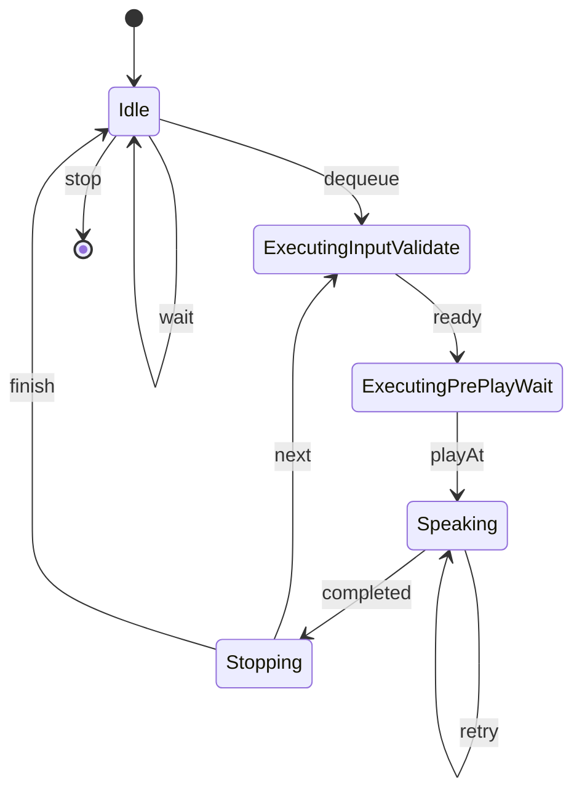

# VoicepeakProxyCore 利用ガイド

`VoicepeakProxyCore` は、VOICEPEAK を UI 自動操作で制御する .NET Framework 4.8 向け DLL です。

このライブラリはアプリケーションから直接関数を呼び出して使います。  
主な用途は次の2つです。

- 常駐ランタイムを起動し、複数の発話要求をキュー投入して順次処理する
- ワーカーループを起動せず、1回だけ単発で発話する

---

## 0. 仕様上の注意点
- **VOICEPEAK側のキーコンフィグで、先頭移動・末尾移動のショートカットをF1~F12のいずれかに指定する必要があります。**
  - 文字入力欄へのフォーカスにはこのショートカットを使用するのが最も確実でしたが、デフォルト設定の`Ctrl+↑`等の合成入力では意図した動作が実現できませんでした。
  - そのため、1キー完結かつ他の入力に影響しないF1\~F12のいずれかのキーにこの2つを充てる前提で実装されています。
  - デフォルトでは`F3`で先頭移動、`F4`で末尾移動としてありますが、configファイルから変更可能です。

## 1. できること

- VOICEPEAK への文字入力と再生操作を自動実行する
- Audio Session のピーク値を監視し、再生開始と再生終了を判定する
- 常駐モードで読み上げ文章のキュー制御を行う
- `interrupt=true` による発話の中断割り込みを行う
- 単発モードで 1 リクエストだけ同期実行する
- `[[pause:NNN]]` 記法による待機挿入を行う
- `TextTransform.ReplaceRules` による文字列置換を行う
- `SendEnterAfterSentenceBreak` によって句点等の区切りで発話ブロックの分割を行う

---

## 2. 前提条件

- Windows 環境であること
- .NET Framework 4.8 実行環境があること
- 対象の `voicepeak.exe` が起動していること
- VOICEPEAK 側のショートカット設定が `AppConfig.Ui` と一致していること
- VOICEPEAK が 1 プロセスだけ起動していること

注意:

- 本 DLL は VOICEPEAK の UI 構造に依存します
- VOICEPEAK の UI 仕様変更やショートカット変更があると動作しなくなる可能性があります
- フォーカス奪取やマウス操作ではなく、メッセージ送信と UIA 読み取りを前提にしています

---

## 3. ビルド

プロジェクト直下で実行します。

```powershell
dotnet build
```

主な生成物:

- `bin/Debug/net48/VoicepeakProxyCore.dll`

依存関係:

- `NAudio`
- `UIAutomationClient`
- `UIAutomationTypes`
- `WindowsBase`

---

## 4. 公開 API の全体像

公開 API は大きく 2 系統です。

### 4.1 常駐ランタイム API

- `VoicepeakRuntime.Start(AppConfig config, IAppLogger logger = null)`
  - 常駐ランタイムを起動します
  - 設定検証と起動時バリデーションを行い、成功時に `VoicepeakRuntime` を返します
- `VoicepeakRuntime.Enqueue(SpeakRequest request)`
  - 発話要求を待機キューへ受理します
  - 実行は非同期で行われ、戻り値は受理結果 (`EnqueueResult`) です
- `VoicepeakRuntime.Stop()`
  - 新規受理を停止し、ランタイム停止処理を開始します
  - `Stop()` 後の `Enqueue(...)` は `InvalidOperationException` を投げます
- `VoicepeakRuntime.Dispose()`
  - ランタイムを破棄します
  - 停止処理と内部リソース解放を行います
- `VoicepeakRuntime.IsShutdownRequested`
  - 内部で停止要求が発生しているかを返します
  - 例: `voicepeak.exe` 喪失時

用途:

- 起動後に待機し続け、複数の発話要求を処理したい場合
- キュー制御や割り込み制御を使いたい場合

### 4.2 単発実行 API

- `VoicepeakOneShot.SpeakOnce(AppConfig config, SpeakOnceRequest request, IAppLogger logger = null)`

用途:

- 常駐させず 1 回だけ実行したい場合
- バッチ処理や外部スクリプトから単発呼び出ししたい場合

単発 API の入力検証は `config.Validation.RequestValidation` に従います。

ここでいう `validation` は、`SpeakOnceRequest.Text` を `Job` に変換する際の入力検証です。  
起動時バリデーション (`BootValidation`) や `AppConfig` 自体の設定検証とは別です。  
なお、単発 API はどちらも起動時バリデーションを実行しません。

---

## 5. 最小利用例

### 5.1 常駐ランタイム

```csharp
using VoicepeakProxyCore;

var config = new AppConfig();
using var runtime = VoicepeakRuntime.Start(config);

var result = runtime.Enqueue(new SpeakRequest
{
    Text = "こんにちは。テストです。",
    Mode = EnqueueMode.Queue,
    Interrupt = false
});

Console.WriteLine($"status={result.Status} jobId={result.JobId} error={result.ErrorMessage}");
```

### 5.2 単発実行

単発実行の最小例です。

```csharp
using VoicepeakProxyCore;

var config = new AppConfig();

var request = new SpeakOnceRequest
{
    Text = "単発読み上げです。"
};

SpeakOnceResult result = VoicepeakOneShot.SpeakOnce(config, request);
Console.WriteLine($"status={result.Status} ok={result.Succeeded} segments={result.SegmentsExecuted}");
```

---

## 6. 入力形式

### 6.1 常駐ランタイム用 `SpeakRequest`

`VoicepeakRuntime.Enqueue(...)` で使う型です。

- `Text: string`
  - 発話テキスト
  - `[[pause:NNN]]` を埋め込み可能
- `Mode: EnqueueMode`
  - `Queue` / `Next` / `Flush`
- `Interrupt: bool`
  - 実行中ジョブに対する割り込み要求

`mode` の意味:

- `Queue`: 待機キュー末尾へ追加
- `Next`: 待機キュー先頭へ追加
- `Flush`: 待機キューを消して先頭へ追加

### 6.2 単発実行用 `SpeakOnceRequest`

`VoicepeakOneShot` で使う型です。

- `Text: string`
  - 発話テキスト
  - `[[pause:NNN]]` を埋め込み可能

単発 API には `mode` / `interrupt` はありません。  
単発実行は内部的に「1 ジョブを同期実行する」契約であり、キュー制御や割り込み制御は公開 API に含めていません。

### 6.3 `[[pause:NNN]]` 記法

入力文字列中に `[[pause:NNN]]` を書くと待機区間として解釈されます。

例:

```text
こんにちは[[pause:3000]]お待たせしました
```

挙動:

- `NNN` はミリ秒整数
- 負値は 0 扱い
- 文字入力等に固定でかかる時間も含めるため、500ms程度の短時間を指定してもそれ以上に時間がかかるケースが多いです。
  - 数秒程度以上の待機時間であれば比較的正確に反映できます。

### 6.4 文字列置換

`AppConfig.TextTransform.ReplaceRules` を上から順に1回ずつ適用します。句読点のポーズ時間調整等に利用できます。

- `[[pause:NNN]]` の制御記法自体には適用されません
- 置換対象は通常テキスト部分のみです

例:

```csharp
config.TextTransform.ReplaceRules.Add(new ReplaceRule
{
    From = "。",
    To = "。、。"
});
```

---

## 7. ライフサイクルと動作モデル

### 7.1 常駐ランタイムの流れ

1. `VoicepeakRuntime.Start(...)` を呼ぶ
2. 設定バリデーションを行う
3. ランタイム内部ワーカーを起動する
4. 起動時バリデーションを実行する
5. 成功後、`Enqueue(...)` を受け付ける
6. キューに入ったジョブを順次実行する
7. `Stop()` または `Dispose()` で停止する

重要:

- `Enqueue(...)` は非同期受理です
- 発話完了待機 API は現時点でありません
- `Stop()` 後または停止中の `Enqueue(...)` は `InvalidOperationException` を投げます
- `Dispose()` 後の `Enqueue(...)` は `ObjectDisposedException` を投げます

#### 正常系状態遷移(模式図)



### 7.2 単発実行の流れ

1. `VoicepeakOneShot.SpeakOnce(...)` を呼ぶ
2. 設定バリデーションを行う
3. `voicepeak.exe` の存在と対象ウィンドウ解決を確認する
4. 1 ジョブだけ同期実行する
5. 実行結果を `SpeakOnceResult` で返す

重要:

- 単発 API はワーカーループを起動しません
- 起動時バリデーションは実行しません
- 呼び出しは同期で、戻るまで処理を占有します

---

## 8. 戻り値

### 8.1 `EnqueueResult`

常駐ランタイムの受理結果です。

- `Status`
  - `Accepted`: 受理
  - `QueueFull`: キュー満杯
  - `InvalidRequest`: 入力不正
- `JobId`
  - `Status` が `Accepted` の場合に設定
- `ErrorMessage`
  - `Status` が `QueueFull` / `InvalidRequest` の場合に設定

補足:

- 戻り値はDLL向けの型付き結果です

### 8.2 `SpeakOnceResult`

単発実行の結果です。

- `Status: SpeakOnceStatus`
- `Succeeded: bool`
- `SegmentsExecuted: int`
- `ErrorMessage: string`

代表的な `Status`:

- `Completed`
- `InvalidRequest`
- `ProcessNotFound`
- `MultipleProcesses`
- `TargetNotFound`
- `PrepareFailed`
- `StartConfirmTimeout`
- `MaxSpeakingDurationExceeded`
- `ProcessLost`

---

## 9. 設定 (`AppConfig`)

### 9.1 基本方針

- `new AppConfig()` で DLL 内の既定値入り設定オブジェクトを取得できます
- Core は YAML / JSON / env などの設定ファイル読込機能を持ちません
- 設定ファイルの配置や読み込みはホスト側で行う想定です
- ホスト側で読み込んだ値を `AppConfig` に詰めて DLL へ渡してください

### 9.2 主要設定項目

#### `ServerConfig`

- `MaxQueuedJobs` (`default: 500`)
  - 常駐ランタイムの待機キュー上限

#### `AudioConfig`

- `PeakThreshold` (`default: 1e-9f`)
  - 発話中か否かの閾値となる音量の値を指定します。
- `PollIntervalMs` (`default: 50`)
  - 発話中判定の頻度をms単位で指定します。
- `StartConfirmWindowMs` (`default: 1000`)
  - 再生ボタンを押してからこの秒数(ms)が経過しても音量が`PeakThreshold`を下回り続けていた場合、発話エラーとします。
- `StopConfirmMs` (`default: 300`)
  - 発話確認後、音量がこの秒数(ms)だけ`PeakThreshold`を下回り続けた場合、発話終了と判定します。
- `MaxSpeakingDurationSec` (`default: 300`)
  - 何らかのこの秒数を超えても発話され続けていた場合、エラーとします。

#### `PrepareConfig`

- `BootValidationText` (`default: "初期化完了"`)
  - 起動時バリデーションに成功した際に発話する文字列です。
  - 空文字の場合、発話に成功したか否かのバリデーションはスキップします。
- `BootValidationMaxRetries` (`default: 2`)
  - 起動時の文字入力・カーソル移動バリデーションの失敗時に何回リトライするかを指定します。
  - voicepeak.exeの起動直後等、意図せぬ入力エラーが発生する場合があるため、1回以上は指定するのを推奨します。
- `BootValidationRetryIntervalMs` (`default: 1000`)
  - 起動時の文字入力・カーソル移動バリデーションの失敗時、リトライまでの待機秒数を指定します。
  - あまり早すぎると再失敗する場合があるので、ある程度余裕を持って指定するのを推奨します。
- `CharDelayBaseMs` (`default: 1`)
  - 文字入力時の1文字ごとのディレイ秒数(ms)を指定します。
  - 0にするとより高速になりますが、長文入力時に入力負荷で読み上げに失敗するケースがあるため、適切な値を探ってください。
- `ActionDelayMs` (`default: 5`)
  - 先頭移動や再生等のアクション実行時のディレイ秒数(ms)を指定します。
- `PostTypeWaitPerCharMs` (`default: 4`)
  - 文字の入力完了後、音声生成まで待機する時間の倍率を指定します。
  - voicepeakは1文ごとに音声を生成するため、文字の入力完了後、最大の文字列長と本倍率を掛けた秒数(ms)だけ待機します。
    - 例: 入力が"こんにちは。テスト。"で`PostTypeWaitPerCharMs=4`の場合、"こんにちは。"の6文字*4の24msが待機時間となります。
- `PostTypeWaitMinMs` (`default: 100`)
  - 上記`PostTypeWaitPerCharMs`を元にした待機時間がこの値より小さい場合、この待機時間で上書きします。
    - 例: `PostTypeWaitPerCharMs`基準の待機時間が24msで`PostTypeWaitMinMs=100`の場合、待機時間は100msに上書きされます。


#### `UiConfig`

- `MoveToStartShortcut` (`default: "F3"`)
  - voicepeak側の"先頭に移動"ショートカットを指定してください。
  - デフォルトの"Ctrl+↑"のようなキーアサインは使用できません。"F1~F12"までのいずれかを指定してください。
- `MoveToEndShortcut` (`default: "F4"`)
  - voicepeak側の"末尾に移動"ショートカットを指定してください。
  - デフォルトの"Ctrl+↓"のようなキーアサインは使用できません。"F1~F12"までのいずれかを指定してください。
- `PlayShortcut` (`default: "Space"`)
  - voicepeak側の"再生/停止"ショートカットを指定してください。
- `PlayPreShortcutDelayMs` (`default: 60`)
  - 再生を実行する直前のディレイ秒数(ms)です。
- `SendEnterAfterSentenceBreak` (`default: false`)
  - `true`にすると、`SentenceBreakTriggers`で指定した文字列の後にセリフブロックを追加し、移行します。
- `SentenceBreakTriggers` (`default: ["。", "！", "？", "!", "?"]`)
  - `SendEnterAfterSentenceBreak=True`の場合にセリフブロック追加を行う対象文字です。
  - `!?`等の複数文字からなる単語も指定でき、複数が一致する場合は最長単語を優先します。
  - 例: `SentenceBreakTriggers=["！", "？", "！？"]`の際に`え！？本当？`が入力されると、`え！？`と`本当？`に分割されます。

#### `TextTransformConfig`

- `ReplaceRules`
  - `[{"from": "GitHub", "to": "ギットハブ"}, {"from": "NVIDIA", "to": "エヌビディア"}]`のように指定することで、入力文字列を読み上げ前に置換できます。

#### `ValidationConfig`

- `BootValidation` (`default: Required`)
- `RequestValidation` (`default: Strict`)

### 9.3 例: C# で直接設定

```csharp
var config = new AppConfig
{
    Prepare = new PrepareConfig
    {
        BootValidationText = "初期化完了",
        CharDelayBaseMs = 1,
        ActionDelayMs = 5,
        PostTypeWaitPerCharMs = 4,
        PostTypeWaitMinMs = 100
    },
    Ui = new UiConfig
    {
        MoveToStartShortcut = "F3",
        MoveToEndShortcut = "F4",
        PlayShortcut = "Space",
        PlayPreShortcutDelayMs = 60,
        SendEnterAfterSentenceBreak = true,
        SentenceBreakTriggers = new System.Collections.Generic.List<string> { "。", "。、。" }
    }
};
```

---

## 10. 設定バリデーション

`AppConfigValidator.Validate(...)` で起動前に主要な設定不正を検出します。

主な検証内容:

- `config` と各セクションが `null` でないこと
- 数値設定が許容範囲にあること
- `Prepare.BootValidationText` が `null` でないこと
- ショートカット文字列が有効形式であること
- `SentenceBreakTriggers` が `null` でなく、各要素が空文字でないこと
- `TextTransform.ReplaceRules` が `null` でないこと

ショートカット形式として現在サポートしている主な例:

- `F3`
- `F4`
- `Space`
- `Ctrl+F3`
- `Shift+F4`
- `Alt+Space`
- `Home`
- `End`

補足:

- サポート外の形式は設定バリデーションで失敗します
- `Delete` や `Enter` は現在ショートカット設定値としてはサポートしていません

---

## 11. 検証モード

### 11.1 `BootValidationMode`

- `Required`
  - 起動時バリデーション失敗時に `Start(...)` は例外
- `Optional`
  - 起動時バリデーション失敗でも起動継続
- `Disabled`
  - 起動時バリデーションを実行しない

### 11.2 `RequestValidationMode`

- `Strict`
  - 入力不正を明確にエラー扱い
- `Lenient`
  - 一部補正しながら受理
- `Disabled`
  - 最低限の整形のみで実行

使い分け:

- 常駐ランタイムと単発実行の入力検証は `config.Validation.RequestValidation` を使用します

---

## 12. ログ

既定ではコンソールへ出力します。  
独自の `IAppLogger` を渡すことで出力先を差し替えできます。

```csharp
public interface IAppLogger
{
    void Debug(string message);
    void Info(string message);
    void Warn(string message);
    void Error(string message);
}
```

主なログキー:

- `boot_start`
- `boot_validation_ok`
- `boot_validation_fail`
- `boot_validation_skipped`
- `job_received`
- `job_dropped`
- `segment_start`
- `play_pressed`
- `speak_start_confirmed`
- `speak_end_confirmed`
- `monitor_timeout`
- `interrupt_applied`
- `runtime_started`
- `runtime_stopping`
- `runtime_disposed`

補足:

- ロガーはインスタンス単位です
- 常駐ランタイムと単発実行を同一プロセスで混在させても、ロガーは相互上書きしません

---

## 13. VSCode / Python 利用時の注意

`pythonnet` で DLL を `clr.AddReference(...)` して使う場合、VSCode の Python LSP は DLL 型を静的に解析しにくいため、次のような制限があります。

- `SpeakOnceRequest` や `AppConfig` などの型へ「定義へ移動」が効かないことがある
- 補完や型解析が不完全になることがある
- Python 側では正しく実行できても、エディタ上では unresolved import に見えることがある

これは `pythonnet` による実行時ロードの性質によるもので、必ずしも実装不備ではありません。

対処方針:

- DLL の公開 API はこの README を正とする
- 詳細実装を追うときは C# 側ソースを開く
- Python サンプルは実行確認用と割り切る

---

## 14. よくある問題

### `Boot validation failed.`

確認項目:

- `voicepeak.exe` が起動しているか
- ショートカットが設定と一致しているか
- 入力欄の読取に失敗していないか
- `BootValidationText` が適切か

### `Runtime is stopping and cannot accept new requests.`

原因:

- `Stop()` 後または停止中に `Enqueue(...)` を呼んでいます

対処:

- ランタイム再生成前提で扱う
- 呼び出し側で `InvalidOperationException` を `try-catch` する

### `speak_start_confirmed` までは出るが終了しない

確認項目:

- `Audio.PeakThreshold`
- `Audio.StopConfirmMs`
- `Audio.PollIntervalMs`
- VOICEPEAK 側で実際に音声セッションが継続していないか

### `QueueFull`

原因:

- 待機キューが `Server.MaxQueuedJobs` を超えています

対処:

- `Server.MaxQueuedJobs` を増やす
- 呼び出し側で投入レートを制御する

### `config` バリデーションでショートカット形式エラーになる

原因:

- サポート外ショートカットを設定しています

対処:

- `F1-F12`, `Space`, `Home`, `End` と `Ctrl` / `Shift` / `Alt` の組み合わせで設定する

---

## 15. 制約と今後の注意点

- 常駐ランタイムの戻り値は `EnqueueResult` の型付き結果です
- 発話完了待機 API は未実装です
- 設定の YAML 書き出し API は未提供です
- UI 依存実装のため、VOICEPEAK 側変更に弱いです
- `SpeakRequest` は `Text` / `Mode` / `Interrupt` を使用します
