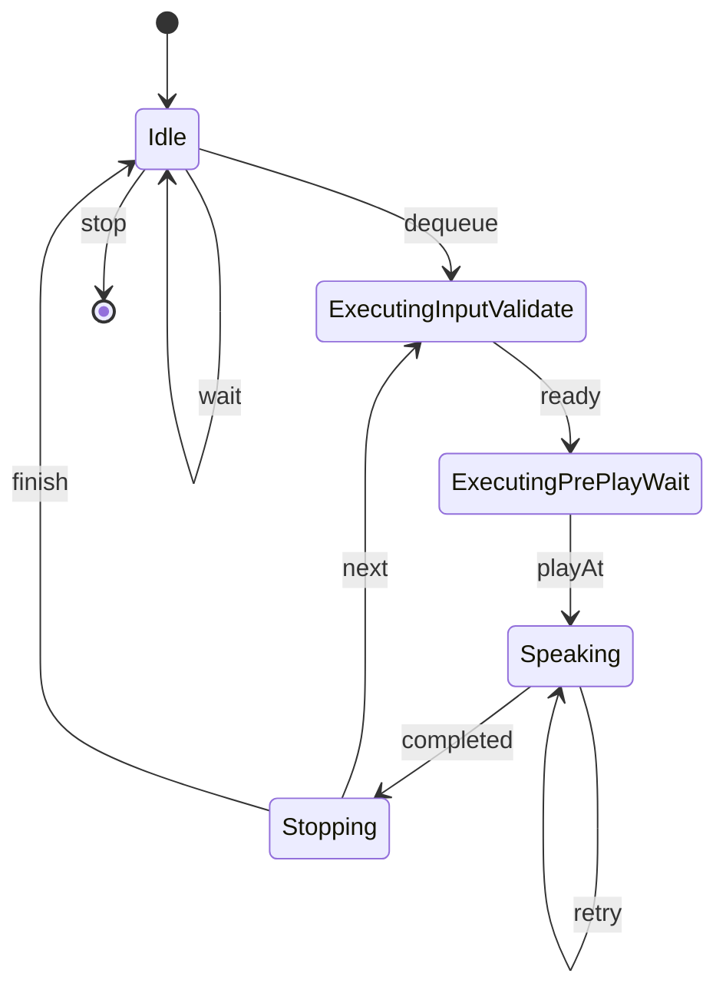

# Runtime Model

このドキュメントは内部実装寄りの動作モデルをまとめたものです。

## 常駐ランタイムの流れ

1. `VoicepeakRuntime.Start(...)`
2. 設定バリデーション
3. 内部ワーカー起動
4. 起動時バリデーション
5. `Enqueue(...)`受理
6. キュー内ジョブを順次実行
7. `Stop()`または`Dispose()`で停止

## 単発実行の流れ

1. `VoicepeakOneShot.SpeakOnce(...)`
2. 設定バリデーション
3. `voicepeak.exe`と対象ウィンドウ解決
4. 1ジョブを同期実行
5. `SpeakOnceResult`返却

## 常駐ワーカー正常系状態遷移

## 状態の意味

- `Idle`
  - キュー待機中です
- `ExecutingInputValidate`
  - 入力欄クリアと文字入力を行う段階です
- `ExecutingPrePlayWait`
  - `PausePreMs`や入力後待機を消化する段階です
- `Speaking`
  - 再生押下後の開始確認/終了確認/再試行を行う段階です
- `Stopping`
  - trailing pause待機を行う段階です

## 開始確認再試行

- `Audio.StartConfirmWindowMs`内に発話開始が検知できない場合は`StartTimeout`になります
- `Audio.StartConfirmMaxRetries`が残っていれば、`MoveToStart`→`PressPlay`→開始確認を再試行します
- この再試行は常駐実行、単発実行、起動時バリデーションに適用されます
